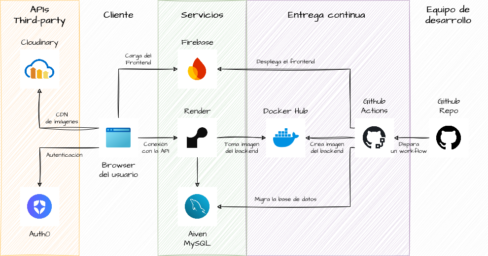

# Deploy

Este repo está configurado para hacer el despliegue del código automáticamente con Github Actions.

Se despliegan tres servicios:
 - El frontend ([ver el workflow](./frontend/Readme.md)) se despliega a [Firebase Hosting](https://firebase.google.com/docs/hosting?hl=es-419).
 - El backend (workflow todavía no implementado) se despliega a [Render Web Services](https://docs.render.com/web-services).
 - La base de datos (workflow todavía no implementado) se despliega a [Aiven MySQL](https://aiven.io/mysql).

Cada servicio se encuentra duplicado para cada [entorno de despliegue](#ambientes-o-entornos-de-despliegue).

## Arquitectura de la aplicación

El siguiente diagrama muestra la arquitectura de la aplicación. Es igual tanto para el ambiente de staging como el de producción:

<picture>
  <source media="(prefers-color-scheme: dark)" srcset="./arch-dark.png">
  
</picture>

## Ambientes o entornos de despliegue

El despliegue se realiza a dos entornos distintos:

### **PROD**

Es el entorno de producción. Contiene la versión final de cada servicio y es públicamente accesible por el usuario.

Se despliega a este entorno cuando se hace un push a la rama `main`.
  
### **STAGING**

Es un entorno idéntico al de producción, pero se encuentra aislado del público. Se usa principalmente para testear la aplicación antes de lanzarla a PROD.

Se despliega a este entorno cuando se hace un push a la rama `develop`.

> [!TIP]
> Más información acerca de las [diferencias entre el ambiente de producción y staging](https://dev.to/flippedcoding/difference-between-development-stage-and-production-d0p).
